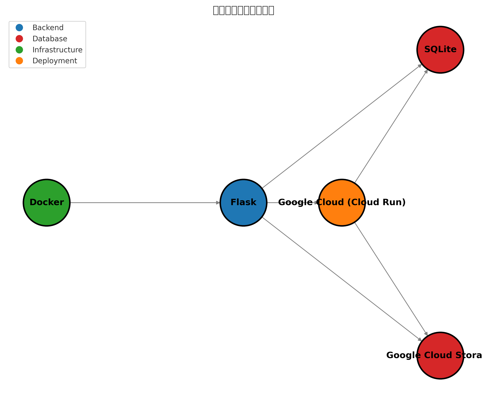

# レゴテキストサイト

このサイトは、レゴを活用して作成されたロボット学習テキストを簡単に共有し、広く情報を発信が行えるサイトになっています。サイトはシンプルで見やすく、教育や展示にも活用できます。

---

# URL先：https://daodaotext.com/

---

## アプリケーションの特徴

1. 作成したテキストをPDF書式で提供することにより、ダウンロードなどを含めて、誰でもアクセスできるような可用性を持たせた。
2. テキストを難易度ごとに大きく分けて、ボタンを使用して、ロボットの機構ごとにソートする機能を持たせた。
3. ログイン機能を活用し、ユーザーは自身の作成したテキストを公開できるようにした。ログイン機能を活用して、さらなる機能の追加に応用できる。

---

## アプリケーションのこだわりポイント

1. 機構の絞り込み機能で自分の使いたいテキストを調べることができる。
2. テキストを見るボタンをおしゃれな見た目にした。
3. ページのトップにスライドショー形式でテキストを画面を流した。

---

## 使用技術スタック

- **バックエンド**：Flask (2.3.3)
- **データベース**：SQLite (3.43.2) & Google Cloud Storage
- **インフラ**：Docker (3.8)　
- **デプロイ**：Google Cloud (Cloud Run)

---

## 技術選定の理由

### 1. Flask
- インターンシップで経験したフレームワークであるため、スムーズに開発ができる。
- 運用コストを考えて、軽量で小規模で使用するデータ量の少ないフレームワークを使用した。

### 2. SQLite
- ファイルベースのデータベースで、サーバー費用を抑えつつ永続的にデータを管理可能。
- MySQLなどの外部データベースを使用すると、費用が増加するため、無料で使用できるSQLiteを採用した。
- 一つの欠点として、32MBを超えるファイルは送れないため、Google Cloud Storageを使用している。

### 3. Cloud Run
- Dockerコンテナをそのままデプロイできる無料サービス。
- GitHubと連携することで、継続的なデプロイが可能になっている。

---

## セキュリティ対策

- **Dos/DDos対策**：キャッシュ数を制限し、一時的なアクセス過多を防止。
- **HTTPS強制**：Flask-Talismanを使用してHTTPS通信を強制。
- **CSP制限**：特定のHTML、CSS、JavaScriptファイルのみを許可する。
- **Cookieの発行**：PDFを表示させるには、Cookieの発行を強制する。

---

## 今後の課題

### 1. 高度な機能の実装
- テキストに対するコメント機能を実装して、ユーザーの評価を集める。
- 現在、ログイン機能があるため、この機能を使ってログインしているユーザーのみが自分の作品などを公開できるページと機能を作成する。

### 2. ユーザーインターフェースの充実
- テキストページから他のテキストにアクセスを行うことができないため、テキストページから他のテキストにアクセスする手段を作成する。

### 3. データの効率的な管理
- 現在、データベースがファイルベースのSQLiteのため、Google Apps Script（GAS）を使いスプレッドシートをデータベースとして活用して、スプレッドシートにデータを追加すると反映できるようにする。
